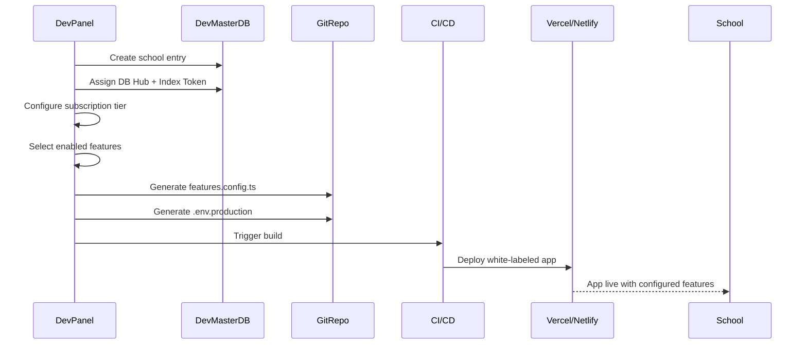
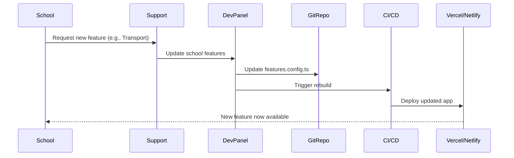

# EduMunch: Feature Toggle Architecture

> Code-based feature management system to enable/disable features per school without database overhead

---

## Index Token Assignment

Each school is assigned a unique Index Token used as suffix for all database tables:

| School # | Index Token | Mnemonic |
|---------|-----------|----------|
| 1 | 1ENTK | Ek Number Tuzhi Kambar |
| 2 | 2DDMRH | Do Dil Mil Rahe Hai |
| 3 | 3TTKB | Teen Tigada Kaam Bigada |
| 4 | 4CBW | Char Bottle Vodka |
| 5 | 5HKSK | Hai Katha Sangram Ki |

**Example:** A school with token `1ENTK` will have tables like `users_1ENTK`, `students_1ENTK`, `attendance_1ENTK`, etc.

---

## Problem Statement

Traditional SaaS platforms check feature access through database queries on every app load:

```typescript
// ❌ BAD: Multiple DB queries on every app load
const checkFeature = async (feature: string) => {
  const { data } = await supabase
    .from('school_features')
    .select('enabled')
    .eq('feature_name', feature)
    .single();
  return data?.enabled;
};
```

This causes:
- Increased database load
- Slower app startup time
- Higher Supabase API consumption
- Network latency issues

---

## EduMunch Solution: Build-Time Feature Configuration

Features are embedded directly into the compiled application during the white-label build process.

---

## Implementation Architecture

### 1. Feature Configuration File

Each school deployment includes a TypeScript configuration file:

**File:** `src/config/features.config.ts`

```typescript
/**
 * Feature Toggle Configuration
 * 
 * This file is auto-generated during the build process
 * based on the school's subscription tier and custom requirements.
 * 
 * DO NOT EDIT MANUALLY - Managed by Dev Panel
 */

export interface FeatureConfig {
  // Tier identifier
  subscriptionTier: 'basic' | 'standard' | 'advanced' | 'enterprise';
  
  // Core Features (Always enabled in Basic+)
  userManagement: boolean;
  studentManagement: boolean;
  attendance: boolean;
  examManagement: boolean;
  feeManagement: boolean;
  
  // Standard Tier Features
  lms: boolean;
  library: boolean;
  transport: boolean;
  hostel: boolean;
  staffManagement: boolean;
  homeworkDiary: boolean;
  
  // Advanced Tier Features
  aiAnalytics: boolean;
  parentTeacherMeeting: boolean;
  behaviorTracking: boolean;
  healthManagement: boolean;
  alumniManagement: boolean;
  admissionPortal: boolean;
  inventoryManagement: boolean;
  certificateGeneration: boolean;
  onlinePayments: boolean;
  surveyFeedback: boolean;
  
  // Enterprise Features (Custom XTRA tables)
  advancedPayroll: boolean;
  accountingModule: boolean;
  multiCampus: boolean;
  aiProctoring: boolean;
  customIntegrations: boolean;
  
  // Experimental/Beta Features
  experimentalFeatures: {
    voiceAttendance: boolean;
    aiChatbot: boolean;
    blockchainCertificates: boolean;
  };
}

// ✅ ACTUAL CONFIGURATION FOR THIS SCHOOL
export const FEATURES: FeatureConfig = {
  subscriptionTier: 'standard',
  
  // Core (Always enabled)
  userManagement: true,
  studentManagement: true,
  attendance: true,
  examManagement: true,
  feeManagement: true,
  
  // Standard
  lms: true,
  library: true,
  transport: false, // Disabled for this school
  hostel: false,    // Disabled for this school
  staffManagement: true,
  homeworkDiary: true,
  
  // Advanced (Not included in Standard tier)
  aiAnalytics: false,
  parentTeacherMeeting: false,
  behaviorTracking: false,
  healthManagement: false,
  alumniManagement: false,
  admissionPortal: true, // Custom enabled
  inventoryManagement: false,
  certificateGeneration: false,
  onlinePayments: true, // Custom enabled
  surveyFeedback: false,
  
  // Enterprise (Not available)
  advancedPayroll: false,
  accountingModule: false,
  multiCampus: false,
  aiProctoring: false,
  customIntegrations: false,
  
  // Experimental
  experimentalFeatures: {
    voiceAttendance: false,
    aiChatbot: false,
    blockchainCertificates: false
  }
};

// Helper functions for readable feature checks
export const hasFeature = (feature: keyof FeatureConfig): boolean => {
  return FEATURES[feature] as boolean;
};

export const isExperimentalEnabled = (feature: keyof FeatureConfig['experimentalFeatures']): boolean => {
  return FEATURES.experimentalFeatures[feature];
};
```

---

### 2. Usage in React Components

```typescript
// src/components/Sidebar.tsx
import { FEATURES } from '@/config/features.config';

export const Sidebar = () => {
  return (
    <nav>
      <MenuItem to="/dashboard" icon="home">Dashboard</MenuItem>
      <MenuItem to="/students" icon="users">Students</MenuItem>
      <MenuItem to="/attendance" icon="check">Attendance</MenuItem>
      
      {/* Conditionally render based on feature flags */}
      {FEATURES.lms && (
        <MenuItem to="/lms" icon="book">Learning</MenuItem>
      )}
      
      {FEATURES.library && (
        <MenuItem to="/library" icon="book-open">Library</MenuItem>
      )}
      
      {FEATURES.transport && (
        <MenuItem to="/transport" icon="bus">Transport</MenuItem>
      )}
      
      {FEATURES.hostel && (
        <MenuItem to="/hostel" icon="building">Hostel</MenuItem>
      )}
      
      {FEATURES.onlinePayments && (
        <MenuItem to="/payments" icon="credit-card">Online Payments</MenuItem>
      )}
      
      {/* Advanced features */}
      {FEATURES.aiAnalytics && (
        <MenuItem to="/analytics" icon="chart">AI Analytics</MenuItem>
      )}
    </nav>
  );
};
```

---

### 3. Route Protection

```typescript
// src/routes/AppRoutes.tsx
import { FEATURES } from '@/config/features.config';
import { Navigate } from 'react-router-dom';

// Higher-order component for feature-gated routes
const FeatureRoute = ({ 
  feature, 
  component: Component 
}: { 
  feature: keyof FeatureConfig; 
  component: React.ComponentType;
}) => {
  if (!FEATURES[feature]) {
    return <Navigate to="/404" replace />;
  }
  return <Component />;
};

export const AppRoutes = () => {
  return (
    <Routes>
      {/* Always available */}
      <Route path="/dashboard" element={<Dashboard />} />
      <Route path="/students" element={<Students />} />
      <Route path="/attendance" element={<Attendance />} />
      
      {/* Feature-gated routes */}
      <Route 
        path="/lms" 
        element={<FeatureRoute feature="lms" component={LMS} />} 
      />
      <Route 
        path="/library" 
        element={<FeatureRoute feature="library" component={Library} />} 
      />
      <Route 
        path="/transport" 
        element={<FeatureRoute feature="transport" component={Transport} />} 
      />
      <Route 
        path="/analytics" 
        element={<FeatureRoute feature="aiAnalytics" component={Analytics} />} 
      />
    </Routes>
  );
};
```

---

### 4. API Layer Feature Checks

```typescript
// src/api/feeService.ts
import { FEATURES } from '@/config/features.config';

export const feeService = {
  async processPayment(studentId: string, amount: number) {
    // Check if online payments are enabled
    if (!FEATURES.onlinePayments) {
      throw new Error('Online payments are not enabled for this school');
    }
    
    // Proceed with Razorpay integration
    const order = await razorpay.createOrder({ amount });
    return order;
  },
  
  async recordOfflinePayment(studentId: string, amount: number) {
    // This is always available regardless of online payment feature
    return await supabase
      .from(`fee_payments_${INDEX_TOKEN}`)
      .insert({ student_id: studentId, amount });
  }
};
```

---

### 5. Build-Time Optimization (Tree Shaking)

When webpack/vite bundles the app, unused feature code is automatically removed:

```typescript
// src/features/library/index.ts
import { FEATURES } from '@/config/features.config';

// This entire module will be tree-shaken if library feature is disabled
export const LibraryModule = () => {
  if (!FEATURES.library) {
    return null; // Dead code elimination
  }
  
  return <LibraryDashboard />;
};
```

**Bundle Size Comparison:**
- With ALL features: ~2.5MB
- Basic tier (minimal features): ~800KB
- Standard tier: ~1.2MB
- Tree-shaking saves 60-70% bundle size for lower tiers

---

## Dev Panel Integration

### Feature Management UI

The Dev Panel allows the EduMunch team to configure features for each school:

```typescript
// Dev Panel: School Feature Configuration
interface SchoolFeatureSetup {
  schoolId: string;
  subscriptionTier: string;
  features: FeatureConfig;
}

// When admin saves configuration:
const generateFeatureConfig = async (schoolId: string, features: FeatureConfig) => {
  // 1. Validate subscription tier limits
  validateFeatureAccess(features);
  
  // 2. Generate features.config.ts content
  const configContent = `
export const FEATURES: FeatureConfig = ${JSON.stringify(features, null, 2)};
  `;
  
  // 3. Update school's Git repository
  await updateSchoolRepo(schoolId, 'src/config/features.config.ts', configContent);
  
  // 4. Trigger automated rebuild and deployment
  await triggerBuild(schoolId);
  
  // 5. Update school_registry in Dev Master DB
  await updateRegistry(schoolId, { features, updated_at: new Date() });
};
```

---

## Environment-Specific Configuration

Each school also has environment variables for runtime configuration:

**`.env.production` (Example for School 1 with token 1ENTK)**

```bash
# School Identity
VITE_INDEX_TOKEN=1EMAET
VITE_SCHOOL_NAME=Delhi Public School
VITE_SCHOOL_CODE=DPS001

# Database Connection
VITE_SUPABASE_URL=https://hub-mumbai-01.supabase.co
VITE_SUPABASE_ANON_KEY=eyJhbGci...

# Media Storage
VITE_R2_BUCKET_URL=https://edumunch-media.r2.dev
VITE_R2_PUBLIC_TOKEN=...

# Payment Gateway (if online payments enabled)
VITE_RAZORPAY_KEY=rzp_live_...
VITE_RAZORPAY_SECRET=...

# SMS Gateway
VITE_SMS_API_KEY=...
VITE_SMS_SENDER_ID=EDUMCH

# Email Service
VITE_SMTP_HOST=smtp.gmail.com
VITE_SMTP_USER=noreply@dps.edumunch.in
```

---

## Feature Toggle Workflow

### 1. Initial School Onboarding



### 2. Feature Updates (Mid-Subscription)



---

## Advantages of This Approach

### 1. Performance
- **Zero DB queries** for feature checks
- Features checked in **microseconds** (compile-time constants)
- **No network latency**

### 2. Cost Efficiency
- Reduced Supabase API calls
- Lower bandwidth consumption
- Smaller bundle sizes (tree-shaking)

### 3. Security
- Feature flags not exposed to client manipulation
- No runtime feature bypassing
- Compile-time enforcement

### 4. Developer Experience
- TypeScript type safety
- IDE autocomplete
- Clear feature dependencies

### 5. Deployment Flexibility
- Each school gets a truly isolated build
- No shared runtime state
- Easy rollback per school

---

## Comparison with Database-Driven Approach

| Aspect | Code-Based (EduMunch) | Database-Based (Traditional) |
|--------|----------------------|------------------------------|
| **App Load Time** | Instant | +200-500ms per feature check |
| **DB Queries** | 0 | 10-50 per session |
| **Bundle Size** | Optimized (tree-shaking) | Full codebase always shipped |
| **Feature Update** | Rebuild required | Instant (DB update) |
| **Offline Support** | Full | Limited |
| **Security** | Compile-time | Runtime (can be manipulated) |
| **Cost** | Lower (no extra API calls) | Higher (continuous queries) |

---

## Hybrid Approach for User-Level Permissions

While **feature toggles** are code-based, **user-level permissions** remain database-driven:

```typescript
// Feature check (code-based)
if (!FEATURES.library) {
  return <FeatureNotAvailable />;
}

// Permission check (database-based via RLS)
const { data: userPermissions } = await supabase
  .from(`permissions_${INDEX_TOKEN}`)
  .select('*')
  .eq('user_id', currentUser.id)
  .single();

if (!userPermissions.can_view_library) {
  return <Unauthorized />;
}

// Both checks passed - render library
return <LibraryDashboard />;
```

---

## Future Enhancements

### 1. A/B Testing Support

```typescript
export const FEATURES = {
  // ... other features
  experimentalFeatures: {
    newDashboardUI: Math.random() < 0.5, // 50% users see new UI
  }
};
```

### 2. Time-Based Features

```typescript
export const FEATURES = {
  admissionPortal: Date.now() < new Date('2025-06-30').getTime(), // Auto-disable after admission season
};
```

### 3. Feature Usage Analytics

```typescript
// Track which features are actually used
import { logFeatureUsage } from '@/analytics';

useEffect(() => {
  if (FEATURES.library) {
    logFeatureUsage('library', 'viewed');
  }
}, []);
```

---

## Dev Panel: Feature Management Dashboard

```typescript
// Mock UI for Dev Panel
const FeatureManager = ({ schoolId }: { schoolId: string }) => {
  const [features, setFeatures] = useState<FeatureConfig>(DEFAULT_FEATURES);
  
  const tierPresets = {
    basic: {
      userManagement: true,
      studentManagement: true,
      attendance: true,
      examManagement: true,
      feeManagement: true,
      // All others false
    },
    standard: {
      ...tierPresets.basic,
      lms: true,
      library: true,
      transport: true,
      staffManagement: true,
    },
    advanced: {
      ...tierPresets.standard,
      aiAnalytics: true,
      parentTeacherMeeting: true,
      onlinePayments: true,
      admissionPortal: true,
    },
    enterprise: {
      ...tierPresets.advanced,
      advancedPayroll: true,
      accountingModule: true,
      multiCampus: true,
    }
  };
  
  return (
    <div className="feature-manager">
      <h2>Feature Configuration for {schoolId}</h2>
      
      {/* Quick tier selection */}
      <div className="tier-selector">
        <button onClick={() => setFeatures(tierPresets.basic)}>
          Basic (₹6,800/year)
        </button>
        <button onClick={() => setFeatures(tierPresets.standard)}>
          Standard (₹12,000/year)
        </button>
        <button onClick={() => setFeatures(tierPresets.advanced)}>
          Advanced (₹20,000/year)
        </button>
        <button onClick={() => setFeatures(tierPresets.enterprise)}>
          Enterprise (Custom)
        </button>
      </div>
      
      {/* Granular feature toggles */}
      <div className="feature-toggles">
        <h3>Core Features</h3>
        <Toggle label="User Management" checked={features.userManagement} disabled />
        <Toggle label="Student Management" checked={features.studentManagement} disabled />
        
        <h3>Standard Features</h3>
        <Toggle label="LMS" checked={features.lms} onChange={...} />
        <Toggle label="Library" checked={features.library} onChange={...} />
        <Toggle label="Transport" checked={features.transport} onChange={...} />
        
        <h3>Advanced Features</h3>
        <Toggle label="AI Analytics" checked={features.aiAnalytics} onChange={...} />
        <Toggle label="Online Payments" checked={features.onlinePayments} onChange={...} />
      </div>
      
      <button onClick={() => saveAndDeploy(schoolId, features)}>
        Save & Deploy Changes
      </button>
    </div>
  );
};
```

---

**Status:** Feature toggle architecture complete. Ready for platform-specific documentation.
